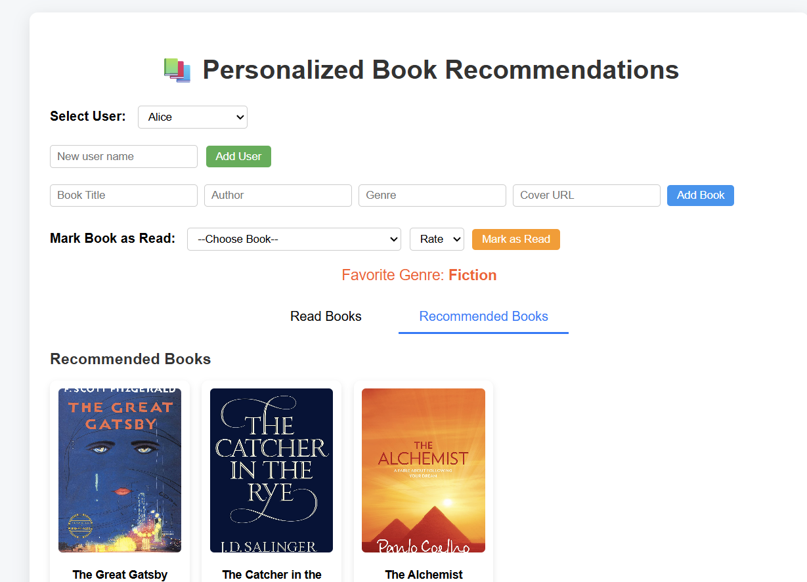

# 📚 Personalized Book Recommendation System

A modern web application that recommends books to users based on their reading habits and preferences. This project uses **FastAPI** for the backend, **MySQL** for database management, and **React** for a clean and interactive frontend. It implements a **hybrid recommendation system** using both **content-based** (favorite genre) and **collaborative filtering** (similar users) techniques.

---

## **Features**

- **User Management**: Add new users and select active users.
- **Book Management**: Add books with title, author, genre, and cover image.
- **Read Books Tracking**: Mark books as read and provide ratings.
- **Hybrid Recommendations**:
  - Recommend books in the user's favorite genre.
  - Suggest books read by similar users (collaborative filtering).
- **Interactive UI**:
  - Tab-based navigation between "Read Books" and "Recommended Books".
  - Book cards with cover images, title, author, genre, and star rating.
  - Favorite genre highlighted for quick insights.
- **Responsive Design**: Clean, professional, and modern UI.

---

## **Tech Stack**

- **Frontend**: React.js, CSS  
- **Backend**: Python, FastAPI  
- **Database**: MySQL  
- **Other**: Axios / Fetch API for client-server communication  

---

## **Folder Structure**
project-root/
├─ backend/
│ └─ main.py
├─ frontend/
│ ├─ src/
│ │ ├─ components/
│ │ │ ├─ UserSelect.js
│ │ │ ├─ UserSelect.css
│ │ │ ├─ BookList.js
│ │ │ ├─ BookList.css
│ │ │ ├─ AddUser.js
│ │ │ ├─ AddUser.css
│ │ │ ├─ AddBook.js
│ │ │ ├─ AddBook.css
│ │ │ ├─ MarkRead.js
│ │ │ └─ MarkRead.css
│ │ ├─ App.js
│ │ └─ App.css
├─ .gitignore
└─ README.md

---

## **Getting Started**

### **Prerequisites**

- Python 3.9+
- Node.js 18+
- MySQL Server
- Git

---

### **Backend Setup (FastAPI + MySQL)**

1. **Create a virtual environment and activate it**

python -m venv venv
# Windows
venv\Scripts\activate
# macOS/Linux
source venv/bin/activate

2. **Install dependencies**
pip install fastapi uvicorn mysql-connector-python

3. **Create MySQL Database & Tables**

CREATE DATABASE bookdb;
USE bookdb;

CREATE TABLE users (
    id INT AUTO_INCREMENT PRIMARY KEY,
    name VARCHAR(50)
);

CREATE TABLE books (
    id INT AUTO_INCREMENT PRIMARY KEY,
    title VARCHAR(100),
    author VARCHAR(50),
    genre VARCHAR(50),
    cover_url VARCHAR(255)
);

CREATE TABLE user_books (
    id INT AUTO_INCREMENT PRIMARY KEY,
    user_id INT,
    book_id INT,
    rating INT,
    FOREIGN KEY (user_id) REFERENCES users(id),
    FOREIGN KEY (book_id) REFERENCES books(id)
);

4. **Run the FastAPI server**
uvicorn main:app --reload

### **Frontend Setup (React)**

1.**Navigate to the frontend folder**
cd frontend

2.**Install dependencies**
npm install

3.**Start the React app**
npm start

The frontend will run on http://localhost:3000 and communicate with FastAPI backend.
API Endpoints
GET /users → Get list of users
POST /users → Add a new user
GET /books → Get all books
POST /books → Add a new book
POST /user_books → Mark a book as read and rate it
GET /recommendations/{user_id} → Get book recommendations with cover and rating

4.**How Recommendations Work**
Identify books already read by the user.
Determine the user's favorite genre from past reads.
Suggest books in favorite genre the user hasn’t read yet.
Recommend books read by similar users (collaborative filtering).
Merge results, remove duplicates, and return a list with cover images and ratings.

5.**Future Enhancements**
Add search and filter options for books.
Sort recommendations by rating or popularity.
Enable user profiles with reading history and statistics.
Add authentication for multiple users.

Screenshots / UI Preview

### License

This project is MIT Licensed.
---
This README is **professional, concise, and explains both backend and frontend setup**.  
If you want, I can also **add a small “Sample Data Section”** with **real book titles, authors, cover URLs, and ratings** so anyone can quickly populate the database and see it working.  
Do you want me to add that?